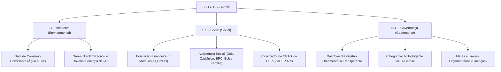

# 🌿 ELO — Conectando Você ao Seu Futuro
### *Aplicativo Mobile Nativo de Educação Financeira, Inclusão Social e Sustentabilidade ESG*

[](https://developer.android.com)
[](https://kotlinlang.org)
[](https://developer.android.com/jetpack/compose)
[](https://dagger.dev/hilt/)
[](https://ai.google.dev/)
[](https://firebase.google.com/)
[](https://github.com/zambonib/ELO_ESG/actions)

---

## 🎯 1. Sobre o Projeto e Requisitos.

O **ELO** é um aplicativo mobile nativo desenvolvido para transformar a teoria dos princípios **ESG (*Environmental, Social and Governance*)** em uma solução prática, inclusiva e escalável.

O projeto foi construído para atender com excelência aos critérios universitários:
- ✅ **Plataforma Nativa:** Construído 100% nativo em **Android (Kotlin)** com arquitetura moderna e declarativa em **Jetpack Compose (Material 3)**.
- ✅ **Escopo de Telas:** Excede o requisito mínimo de 5 telas, entregando **6 telas principais completas** além dos fluxos de autenticação e busca geolocalizada.
- ✅ **Integração com Serviços Externos (Serverless):** Sem necessidade de desenvolvimento de back-end dedicado, integrando-se via APIs e BaaS:
  - 🧠 **Google Gemini AI:** Reconhecimento e categorização de despesas e receitas por linguagem natural (LLM).
  - 🔐 **Firebase Authentication:** Autenticação segura na nuvem de usuários e perfis.
  - 🗺️ **ViaCEP API:** Consulta e localização de serviços públicos e assistência social via CEP.
- ✅ **Alinhamento aos 3 Pilares ESG:** Funcionalidades distribuídas que geram impacto ecológico, inclusão socioeconômica e governança financeira pessoal/familiar.

---

## 🌍 2. O ELO nos Três Pilares do ESG



### 🌱 **E — Ambiental (Environmental):**
- **Tela Economize:** Guia prático de redução de consumo de água e energia elétrica, gerando impacto ecológico positivo e alívio financeiro no orçamento familiar.
- **Green IT & Consciência Computacional:** Dicas de boas práticas no uso de IA para reduzir o consumo de processamento e energia em Data Centers.

### 🤝 **S — Social (Social):**
- **Tela de Educação:** Democratização do conhecimento financeiro através de microaulas de 4–7 minutos (Juros simples/compostos, Gastos essenciais vs supérfluos, Reserva de emergência e Direitos).
- **Gamificação e Fixação:** Flashcards interativos e Quizzes de fixação com feedback imediato.
- **Tela Social & Busca CRAS:** Catálogo detalhado de benefícios públicos e ferramenta de localização dos postos do **CRAS** mais próximos a partir do CEP do cidadão.

### ⚖️ **G — Governança (Governance & Finanças Pessoais):**
- **Dashboard Financeiro:** Visibilidade completa e transparente de entradas, saídas, saldo mensal e extrato detalhado.
- **Registro com Inteligência Artificial (Gemini):** Registro simplificado por voz/texto em linguagem natural ("Gastei 15 reais na feira").
- **Tela de Finanças:** Definição de tetos orçamentários por categoria, gráficos de despesas e score de saúde financeira.

---

## 📱 3. Telas e Funcionalidades do Aplicativo

O aplicativo conta com uma barra de navegação compartilhada (`BarraNavegacaoElo`) que permite transição instantânea entre as abas:

| # | Tela | Rota | Descrição |
|---|---|---|---|
| 🔐 | **Login e Cadastro** | `login` / `cadastro` | Autenticação via Firebase Auth, criação de conta com validação de força de senha em tempo real e perfil seguro. |
| 1️⃣ | **Início (Dashboard)** | `dashboard` | Visão geral de receitas e despesas, cálculo de saldo, barra de progresso do orçamento, busca de lançamentos e FAB de registro com IA. |
| 2️⃣ | **Educação Financeira** | `educacao` | Trilha de 5 módulos independentes com leitura imersiva, sistema de Flashcards com virada de card e Quizzes pontuados. |
| 3️⃣ | **Finanças & Metas** | `financas` | Gráficos de distribuição por categoria, histórico de evolução de 6 meses, definição de metas mensais e score de saúde financeira. |
| 4️⃣ | **Conquistas (Gamificação)** | `conquistas` | Sistema de níveis (Ex: Nível 3 - Guardião Financeiro), barra de XP e medalhas desbloqueáveis conforme o engajamento no app. |
| 5️⃣ | **Economize (ESG)** | `economize` | Guias expansíveis de eficiência energética, uso consciente da água e práticas sustentáveis de Green IT. |
| 6️⃣ | **Assistência Social** | `social` | Informações sobre Bolsa Família, BPC-LOAS, Auxílio Gás e Tarifa Social, com integração para busca de postos de atendimento. |
| 📍 | **Localizador CRAS** | `cras_search` | Tela de consulta por CEP que consome a API do ViaCEP e lista os centros de assistência social mais próximos. |

---

## 🏗️ 4. Arquitetura e Tecnologias Utilizadas

O projeto segue os princípios de **Clean Architecture** e **MVVM (Model-View-ViewModel)** recomendados pelo Google:

```
app/src/main/java/br/com/projeto/elo/
 ├── data/
 │    ├── local/          # Room Database, DAOs (TransacaoDao, OrcamentoDao), Migrations
 │    └── remote/         # Retrofit APIs (GeminiApi, ViaCepApi, DTOs)
 ├── di/                  # Módulos de Injeção de Dependência (Dagger Hilt)
 ├── dominio/             # Modelos de Domínio e Enums de Negócio
 ├── ui/
 │    ├── auth/           # LoginTela, CadastroTela, ViewModels
 │    ├── components/     # BarraNavegacaoElo e componentes reutilizáveis
 │    ├── cras/           # CrasSearchScreen, CrasSearchViewModel
 │    ├── dashboard/      # DashboardTela, DashboardViewModel
 │    ├── financas/       # FinancasTela, FinancasViewModel
 │    ├── screens/        # EducationScreen, EconomizeScreen, SocialScreen, ConquistasScreen
 │    └── theme/          # Color.kt, Type.kt, Theme.kt (Design System M3)
 └── MainActivity.kt      # NavHost com navegação centralizada
```

### 🛠️ Stack Tecnológica:
- **Linguagem:** Kotlin 2.0 (JVM 1.8)
- **UI Toolkit:** Jetpack Compose + Material Design 3
- **Injeção de Dependências:** Dagger Hilt 2.51
- **Banco de Dados Local:** Room Database com Migrations estruturadas
- **Comunicação de Rede:** Retrofit 2 + OkHttp 3 + Gson Converter
- **Inteligência Artificial:** Google Gemini API (`gemini-flash-lite-latest`)
- **Autenticação:** Firebase Authentication Android SDK
- **Carregamento de Imagens:** Coil Compose
- **Assincronismo:** Kotlin Coroutines + StateFlow / Flow

---

## 🧪 5. Testes Automatizados e Qualidade

- **Testes de ViewModel (JVM / JUnit 4):** Testes unitários com MockK validando lógica de cálculo de saldo, regras de negócios e fallback de usuários (`DashboardViewModelTest`, `FinancasViewModelTest`).
- **Testes de Banco de Dados (Room In-Memory):** Testes instrumentados de inserção, edição, exclusão e isolamento de dados (`TransacaoDaoTest`, `FinancasDaoTest`).
- **Linters e Estilo de Código:** Plugin Ktlint integrado com arquivo `.editorconfig`.
- **Pipeline de Integração Contínua (CI):** GitHub Actions configurado para compilar o projeto e rodar testes a cada push ou pull request na branch `main`.

---

## 🔒 6. Segurança e Otimização para Produção

- **R8 / ProGuard Otimizado:** Minificação de código ativada (`isMinifyEnabled = true`), remoção de recursos não utilizados (`isShrinkResources = true`) e regras em `proguard-rules.pro`.
- **Tamanho do APK:** Otimizado para **~7.9 MB** com todos os assets inclusos.
- **Proteção de Credenciais:** As chaves de API sensíveis são injetadas via `local.properties` e `BuildConfig`, impedindo o versionamento de credenciais privadas no repositório.

---

## 🚀 7. Como Executar o Projeto

### Pré-requisitos:
- **Android Studio** Ladybug ou superior
- **JDK 17** ou superior
- Dispositivo Android físico ou Emulador com **Android 8.0+ (API 26+)**

### Passo a Passo:

1. **Clonar o Repositório:**
   ```bash
   git clone https://github.com/zambonib/ELO_ESG.git
   cd ELO_ESG
   ```

2. **Configurar as Chaves Locais:**
   No arquivo `local.properties` (na raiz do projeto), adicione sua chave do Google Gemini:
   ```properties
   sdk.dir=C:\\Users\\SEU_USUARIO\\AppData\\Local\\Android\\Sdk
   GEMINI_API_KEY=sua_chave_gemini_aqui
   ```

3. **Compilar e Executar:**
   - Abra o projeto no **Android Studio**.
   - Aguarde o Gradle sincronizar as dependências.
   - Selecione o dispositivo e clique em **Run (▶️)** ou utilize o terminal:
   ```bash
   ./gradlew assembleDebug
   ```

---

## 👥 8. Equipe do Projeto

Projeto desenvolvido como parte dos requisitos acadêmicos da **FIAP (Fase de Desenvolvimento Mobile Nativo)**.
- RM: 567973
- RM: 567059
- RM: 567306
- RM: 568005
- RM: 568511
- 
- **Repositório Oficial:** [github.com/zambonib/ELO_ESG](https://github.com/zambonib/ELO_ESG.git)
- **Versão:** MVP v1.1 / v1.2 Release

---
*ELO — Fortalecendo o elo entre a tecnologia, as pessoas e o desenvolvimento sustentável.* 🌿
